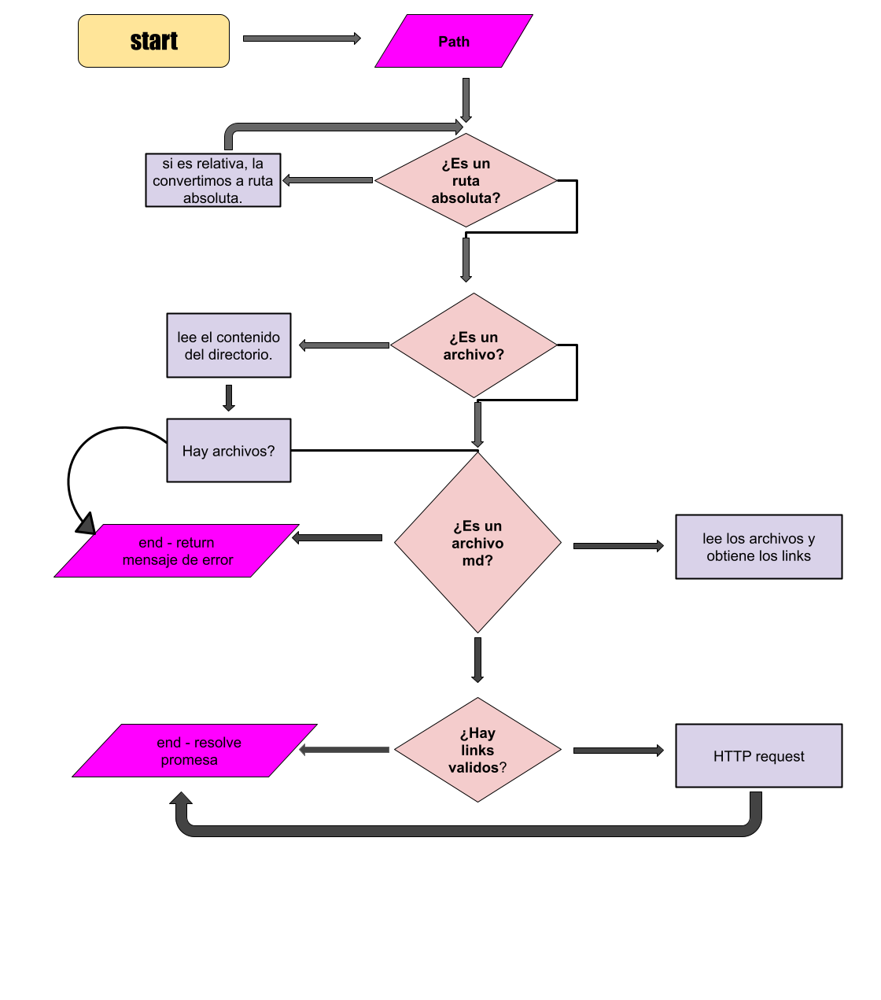

## Markdown Links
"Markdown links" es una forma de crear enlaces en Markdown, una librería que tú mismo puedes utilizar para formatear y crear enlaces en texto de manera sencilla y legible.

Con Md links podrás:
* Encontrar los links dentro de un archivo Markdown.
* Recorrer todos los archivos existentes en el directorio y por cada archivo .md
* Validar los links.
* Un ejecutable (CLI) que podamos invocar en la línea de comando como una interfaz que podamos importar para usarlo programáticamente.
* Pasar un directorio como ruta con más directorios dentro además de posibles archivos.

## Diagrama de flujo

## ¿Como usar esta librería?

* Para ejecutar mdlinks desde la línea de comando, use la siguiente sintaxis: 

mdlinks C:/Users/JARI/OneDrive/Escritorio/md-links/DEV009-md-links/archivesMd/links.md [options]

* Reemplace
 C:/Users/JARI/OneDrive/Escritorio/md-links/DEV009-md-links/archivesMd/links.md 

con la ruta relativa o absoluta al directorio o archivo Markdown que desea analizar. ¡Importante! Se debe proporcionar un path.

- options:

--validate: si se proporciona, mdlinks validará cada enlace que se encuentre en los archivos Markdown y mostrará su estado (OK o Fallo).

--stats: si se proporciona, mdlinks mostrará estadísticas sobre los enlaces encontrados, incluido el número total de enlaces y el número de enlaces únicos y rotos.

--validate --stats: si se proporciona, mdlinks mostrará estadísticas sobre los enlaces validados, incluido el número total de enlaces, enlaces únicos, el número de enlaces válidos (OK) y el número de enlaces rotos (Fallo).

## ¿Como instalarla? 

La podrás instalar desde github con el siguiente comando: 

npm install github:jariannat/DEV009-md-links

## Organización: 

Para este proyecto me planifique llevando a cabo cada hito, asu vez, organice mi trabajo con git hub project board y dejando documentado cada issue. 

